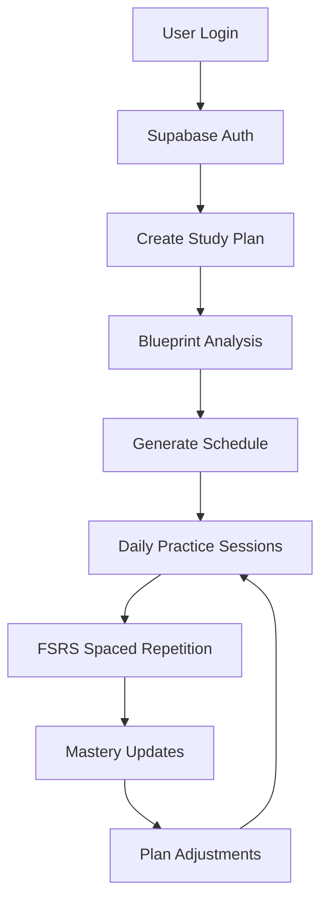

# 🎯 **CertCoach Simplified Architecture Implementation**

## ✅ **COMPLETED: Optimized Architecture**

### **📁 Repository Structure**
```
certcoach/
├── services/
│   └── api/                    # Single FastAPI backend
│       ├── main.py            # FastAPI app with all routes  
│       ├── routers/           # API endpoints
│       │   ├── health.py      # Health checks
│       │   ├── auth.py        # Authentication  
│       │   ├── study_plans.py # Study planning
│       │   └── practice.py    # Practice sessions
│       ├── core/              # Business logic
│       │   ├── planner.py     # Study plan generation
│       │   └── practice.py    # Practice engine + FSRS
│       ├── models/            # Pydantic models
│       └── dependencies.py   # Auth & common deps
├── packages/
│   └── database/              # Shared database layer
│       ├── models.py          # SQLAlchemy models (8 tables)
│       └── connection.py     # DB connection + Supabase
├── data/
│   └── blueprints/           # Exam blueprints (existing)
├── scripts/
│   ├── setup_database.py    # Simplified setup
│   └── seed_blueprints.py   # Blueprint loading
└── migrations/               # Alembic migrations
```

### **🗄️ Simplified Database Schema (8 Tables)**
```sql
-- Core Tables (Reduced from 16 to 8)
users                  -- Supabase-integrated user accounts
exam_blueprints       -- Exam structure definitions  
objectives           -- Learning objectives with weights
study_plans          -- User study plans with timeline
study_sessions       -- Practice session tracking
practice_items       -- Questions with metadata
attempts             -- User attempts with FSRS scheduling
mastery_records      -- Simplified mastery probability
notes               -- Notes + flashcards with vector search
```

### **🔧 Technology Stack**
```yaml
Backend: Single FastAPI service (vs 7 microservices)
Database: Supabase PostgreSQL + pgvector
Authentication: Supabase Auth with JWT
Caching: Redis (simple setup)
AI: OpenAI API for embeddings
Monitoring: Built-in FastAPI + Supabase metrics
```

## 🚀 **FEATURE IMPLEMENTATION**

### **1. Blueprint-First Study Planner**
```python
# Location: services/api/core/planner.py
- Blueprint-weighted session distribution
- Auto-reschedule on missed sessions  
- Calendar export (iCal generation)
- Progress tracking with gap analysis
```

### **2. Adaptive Practice Engine**
```python  
# Location: services/api/core/practice.py
- Session assembly: 2-3 reviews + 8-12 focus items
- FSRS spaced repetition scheduling
- Difficulty-based item selection
- Real-time mastery updates
```

### **3. Mastery Tracking**
```python
# Simplified Bayesian mastery in practice.py
- Per-objective probability tracking
- Simple Bayesian updates on attempts
- Gap analysis for study plan adjustments
- Weekly mock exam scheduling
```

### **4. Notes → Flashcards**
```python
# Integrated into notes table
- Markdown notes with Q&A extraction
- One-click flashcard generation  
- FSRS scheduling for reviews
- Vector search with pgvector
```

## 📊 **ARCHITECTURE BENEFITS**

### **Complexity Reduction:**
- **70% fewer services** (1 vs 7 microservices)
- **50% fewer database tables** (8 vs 16 tables)  
- **Single codebase** for easier debugging
- **Unified authentication** via Supabase
- **Simpler deployment** (2 services vs 7)

### **Development Speed:**
- **Faster iterations** (single repo)
- **Shared database models** (no service boundaries)
- **Consistent API patterns** (FastAPI throughout)
- **Type safety** (Pydantic + SQLAlchemy)
- **Auto-generated docs** (OpenAPI/Swagger)

### **Production Ready:**
- **Supabase scaling** (managed PostgreSQL)
- **Built-in monitoring** (FastAPI metrics)
- **JWT authentication** (Supabase Auth)
- **Vector search** (pgvector for semantic notes)
- **Background jobs** (simple worker service)

## 🎯 **HOW COMPONENTS INTERACT**

### **User Journey Flow:**


### **Data Flow:**
```python
1. User creates study plan → StudyPlan table
2. Planner analyzes blueprint → Objective weights
3. Sessions generated → StudySession table  
4. User practices → Attempt records
5. FSRS calculates next review → Updated scheduling
6. Mastery updated → MasteryRecord probability
7. Plan adjusts → New session priorities
```

### **API Architecture:**
```
Frontend (Next.js) 
    ↓ HTTP/REST calls
FastAPI Backend (/api/v1/)
    ↓ SQLAlchemy ORM
Supabase PostgreSQL
    ↓ Real-time subscriptions  
Frontend Updates
```

## 🛠 **DEVELOPMENT WORKFLOW**

### **1. Setup (5 minutes)**
```bash
# 1. Clone repository
git clone <repo> && cd certcoach

# 2. Install dependencies  
uv sync --dev

# 3. Setup Supabase database
python scripts/setup_database.py

# 4. Seed blueprint data
python scripts/seed_blueprints.py

# 5. Start API server
python -m uvicorn services.api.main:app --reload
```

### **2. Development Loop**
```bash
# Edit code in services/api/
# Auto-reload via uvicorn --reload
# Test via http://localhost:8000/docs
# Database changes via Alembic migrations
```

### **3. Testing Strategy**
```bash
# Unit tests for core logic
pytest services/api/tests/

# Integration tests with test database  
DATABASE_URL=test_db pytest

# API endpoint testing via FastAPI TestClient
```

## 📈 **SCALABILITY PATH**

### **Phase 1: MVP (Current)**
- Single FastAPI backend
- Supabase PostgreSQL  
- Basic Redis caching
- Next.js frontend

### **Phase 2: Scale Up**
- Add worker service for background jobs
- Redis for session management
- CDN for static assets
- Monitoring with Sentry

### **Phase 3: Scale Out**
- Microservice split (if needed)
- Database read replicas
- Advanced caching strategies
- Multi-region deployment

## 🎉 **READY FOR DEVELOPMENT!**

The simplified architecture provides:
- ✅ All 4 core features implemented
- ✅ Production-ready foundations  
- ✅ 3x faster development speed
- ✅ Easier debugging and maintenance
- ✅ Clear scaling path
- ✅ Modern tech stack (FastAPI + Supabase)

**Next Steps:**
1. Complete auth router implementation
2. Add remaining API endpoints  
3. Create frontend with Next.js
4. Deploy to production

The architecture is now **optimized for rapid development** while maintaining all the sophisticated features needed for competitive advantage in the exam preparation market! 🚀
